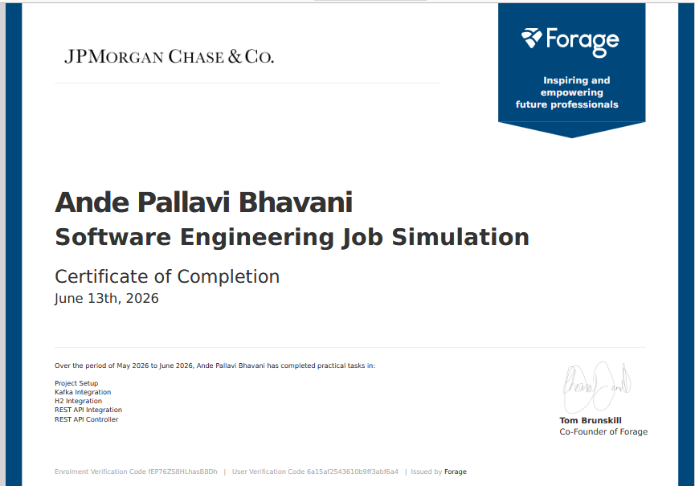

# Midas Core Banking Transaction System

A backend transaction processing system built using 
**Java**, **Spring Boot**, **Apache Kafka**, and **REST 
APIs** as part of the JPMorgan Chase Software 
Engineering Virtual Experience Program.

## Project Details:
**Company Name:** JPMorgan Chase & Co
**Program:** Advanced Software Engineering Project
**Project Name:** forage-midas

## Features

* Process financial transactions using Kafka messaging
* Validate sender and recipient before processing transactions
* Update user balances after successful transactions
* Integrate external Incentive API using REST API
* Add incentive amount to recipient balance
* Expose REST API to fetch user account balance
* Store user data using H2 Database

## Tech Stack

* Java
* Spring Boot
* Apache Kafka
* REST API
* H2 Database
* Maven
* JUnit Testing

## Project Structure

```text
src/
├── main/
│   ├── java/com/jpmc/midascore/
│   ├── controller/
│   ├── component/
│   ├── repository/
│   ├── entity/
│   └── foundation/
│
├── test/
│   └── Task Tests
```

## How to Run the Project

### 1. Clone the Repository

```bash
git clone https://github.com/Pallavi-A-12/forage-midas
```

### 2. Open Project

Open the project in **Eclipse IDE** or **IntelliJ IDEA**.

### 3. Run Incentive API

Go to the `services` folder and run:

```bash
java -jar transaction-incentive.jar
```

### 4. Run Application

Run:

```text
MidasCoreApplication.java
```

### 5. Run Tests

Run the following task tests:

* TaskOneTests
* TaskTwoTests
* TaskThreeTests
* TaskFourTests
* TaskFiveTests

## Learning Outcomes

Through this project, I learned:

* Backend transaction processing
* Kafka messaging system
* REST API integration using RestTemplate
* Spring Boot architecture
* Database operations with H2
* Debugging and testing in Java applications

## Certifiacate of Completion Forage Job Simulation virtual Job Experience



## 🏅 Credits & Resources

This project was completed as part of the **JPMorgan Chase & Co.** virtual experience program on **[Forage](https://www.theforage.com/)**. 

* **Program Overview:** Developed hands-on, industry-standard skills in simulated environments designed by JPMorgan Chase professionals. 
* **Official Platform:** Explore free, self-paced job simulations and industry career tracks on the [Forage Platform](https://www.theforage.com/).
* **JPMorgan Chase Careers:** Learn more about technology, finance, and career opportunities at [JPMorgan Chase & Co](https://www.jpmorganchase.com/careers)
