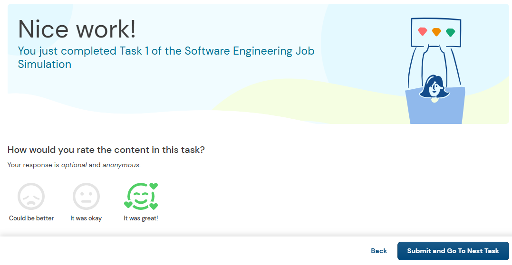
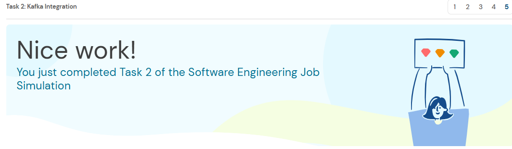
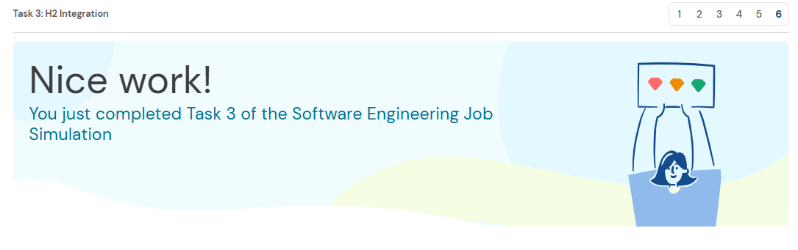

# Midas System
Project repository for the JPMC Advanced Software Engineering Forage program

## Project Details
**Company Name:** JPMorgan Chase & Co

**Program:** Advanced Software Engineering Project

**Project Name:** forage-midas

## About Project
The Midas system, a high-profile initiative responsible for processing financial transactions at scale.

In this program, I will focus on Midas Core — the service responsible for receiving, validating, and recording financial transactions.

 Midas Core relies on several external systems:

- Kafka to receive new transactions
- A SQL database to validate and store data
- A REST API to expose processed information

## 💻 Tech Stack & Tools

- **Language:** Java 17
- **IDE:** Eclipse / IntelliJ CE
- **Build Tool:** Maven
- **Framework:** SpringBoot
- **Data Access:** Spring Data JPA
- **Database:** H2 (In-Memory)
- **Message Queuing:** Apache Kafka
- **API:** REST API
- **Testing:** JUnit

## Tasks
 ### Task-1: Project Setup & Running Test Cases

**What I Did!**

- I set up local development environment by installing Java 17, in Eclipse IDE.
- I exprore the existing project scafflod to understand how the midascore service is structured.
- I add the required dependencies to my spring Boot Project.
-  Build and run TaskOneTests. And Submitted the TaskOneTests output snippet.

### Task-2: Kafka-Integration

**What I Did!**

- I implemented a Kafka listener in Midas Core that reads from the topic defined in application.yml and deserializes each incoming message into the provided Transaction class.
- I run the TaskTwoTests, using debugger to inspect the first four received transactions, and I record the amounts attached to each.

### Task-3: H2-Integration

**What I Did!**

- I configure Midas Core to use an H2 in-memory database       through Spring Boot and JPA.
- Implement validation logic to determine whether a transaction is valid based on user IDs and account balances.
- Created a *TransactionRecord** JPA entity and persist valid transactions while discarding invalid ones.
- Updated the sender and recipient balances when transactions are successfully processed.
- I run TaskThreeTests, to inspect the final balance of the waldorf user by debugging, and I submit the rounded-down value.

